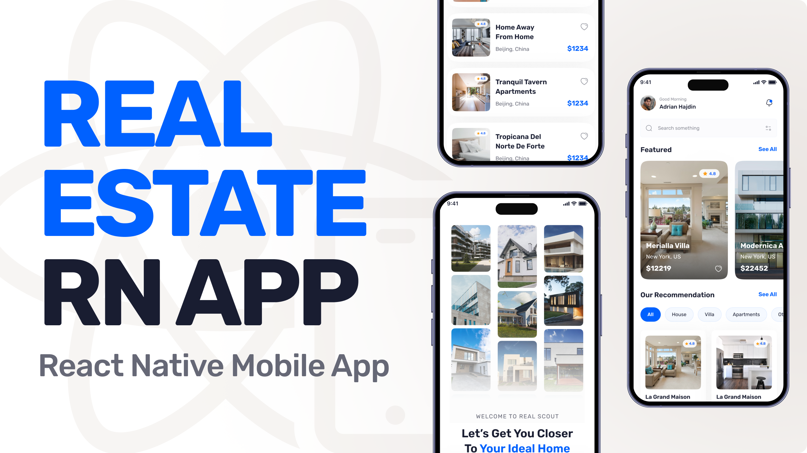

<div align="center">
  <br />
      
  <br />

  <div>
    
    
    
    
  </div>

  <h3 align="center">Real Scout - A Real Estate App</h3>

   <div align="center">
     Find your dream home with Real Scout — the ultimate platform for exploring, buying, and renting properties easily and efficiently.
    </div>
</div>


## 📋 <a name="table">Table of Contents</a>

1. 🤖 [Introduction](#introduction)
2. ⚙️ [Tech Stack](#tech-stack)
3. 🔋 [Features](#features)
4. 🤸 [Quick Start](#quick-start)

## <a name="introduction">🤖 Introduction</a>

Built with Expo, TypeScript, and Appwrite, **Real Scout** is a production-ready real estate platform that simplifies the property discovery journey. Whether you're searching for a new home, listing your property, or just exploring neighborhoods, Real Scout provides a seamless, intuitive experience. Featuring real-time property updates, advanced filtering, and a beautiful mobile-first UI, Real Scout is crafted to meet the needs of modern property seekers and real estate businesses.

## <a name="tech-stack">⚙️ Tech Stack</a>

- Expo
- React Native
- TypeScript
- Nativewind
- Appwrite
- Tailwind CSS

## <a name="features">🔋 Features</a>

### Features of Real Scout - Real Estate App

👉 **Home Screen**: Highlight featured properties, latest listings, and personalized recommendations.

👉 **Property Search**: Advanced filters by price, location, type, and amenities.

👉 **Property Details**: Provides comprehensive information about individual properties, including images and key details.

👉 **Explore Page**: Allows users to browse all types of properties with a clean and intuitive interface.

👉 **Profile Page**: Customizable user settings and profile management

👉 **Authentication with Google**: Secure and seamless user sign-ins using Google’s authentication service.

👉 **Centralized Data Fetching**: Custom-built solution inspired by TanStack’s useQuery for efficient API calls.

and much more, including modular architecture and reusability.

## <a name="quick-start">🤸 Quick Start</a>

Follow these steps to set up the project locally on your machine.

**Prerequisites**

Make sure you have the following installed on your machine:

- [Git](https://git-scm.com/)
- [Node.js](https://nodejs.org/en)
- [npm](https://www.npmjs.com/) (Node Package Manager)

**Cloning the Repository**

```bash
git clone https://github.com/galembeck/real-scout.git
cd real-scout
```

**Installation**

Install the project dependencies using npm:

```bash
npm install
```

**Set Up Environment Variables**

Create a new file named `.env.local` in the root of your project and add the following content:

```env
EXPO_PUBLIC_APPWRITE_ENDPOINT=https://fra.cloud.appwrite.io/v1
EXPO_PUBLIC_APPWRITE_PROJECT_ID=
EXPO_PUBLIC_APPWRITE_DATABASE_ID=
EXPO_PUBLIC_APPWRITE_GALLERIES_COLLECTION_ID=
EXPO_PUBLIC_APPWRITE_REVIEWS_COLLECTION_ID=
EXPO_PUBLIC_APPWRITE_AGENTS_COLLECTION_ID=
EXPO_PUBLIC_APPWRITE_PROPERTIES_COLLECTION_ID=
```

Replace the values with your actual Appwrite credentials. You can obtain these credentials by signing up & creating a new project on the [Appwrite website](https://apwr.dev/JSM050).

**Start the app**
   
```bash
 npx expo start
```

Open [http://localhost:3000](http://localhost:3000) in your browser to view the project. 